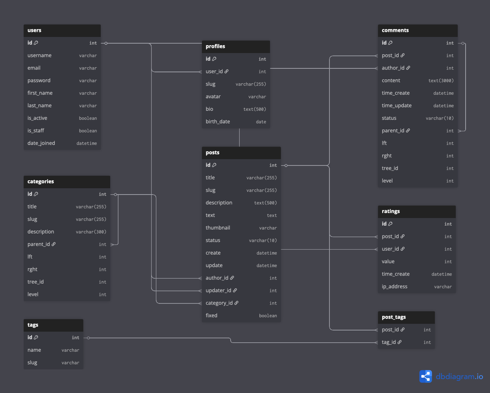
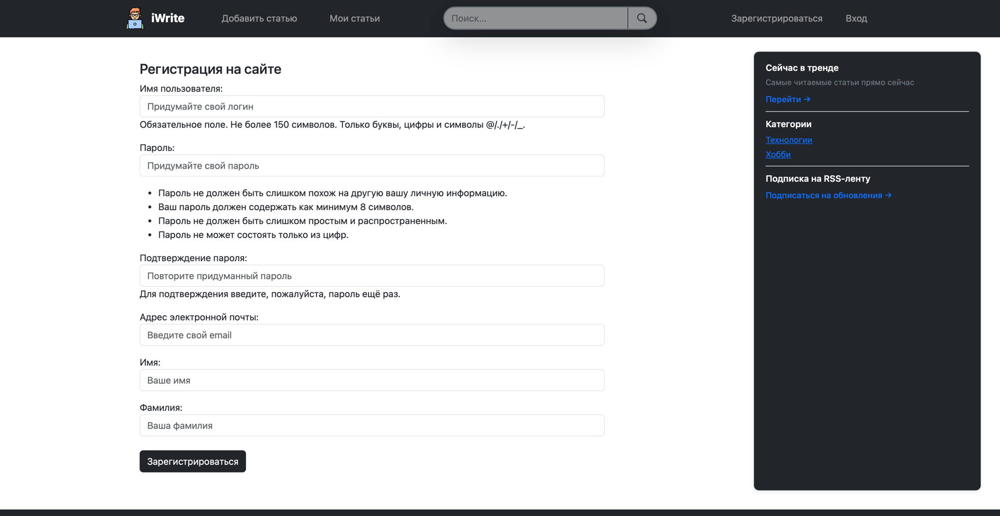
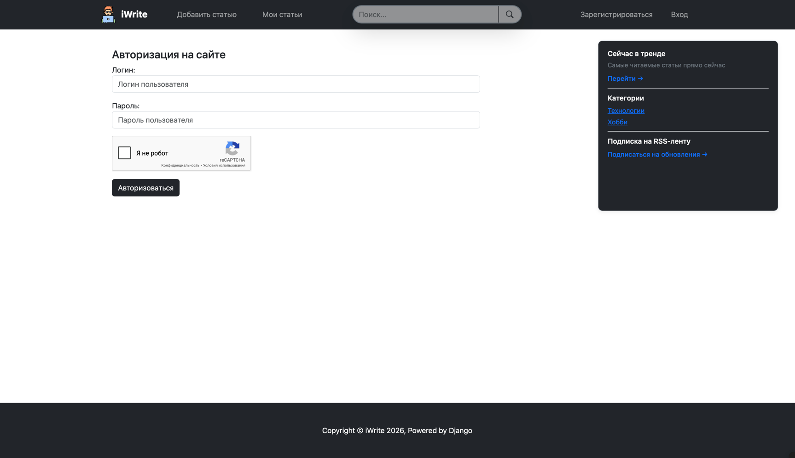
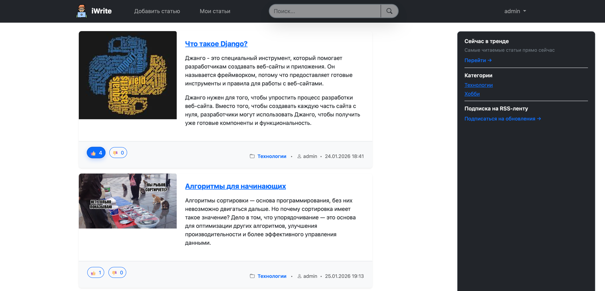
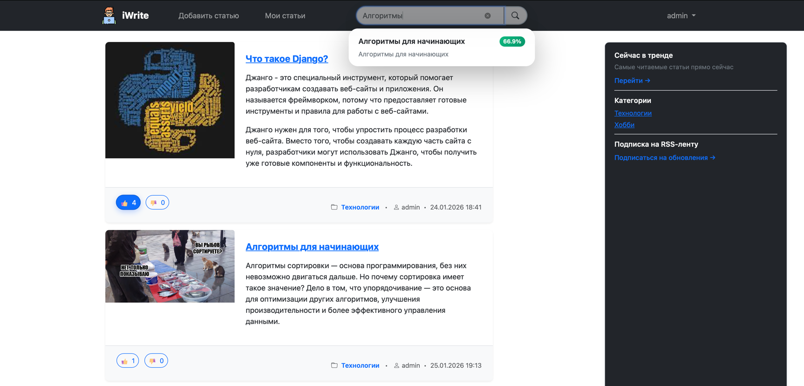
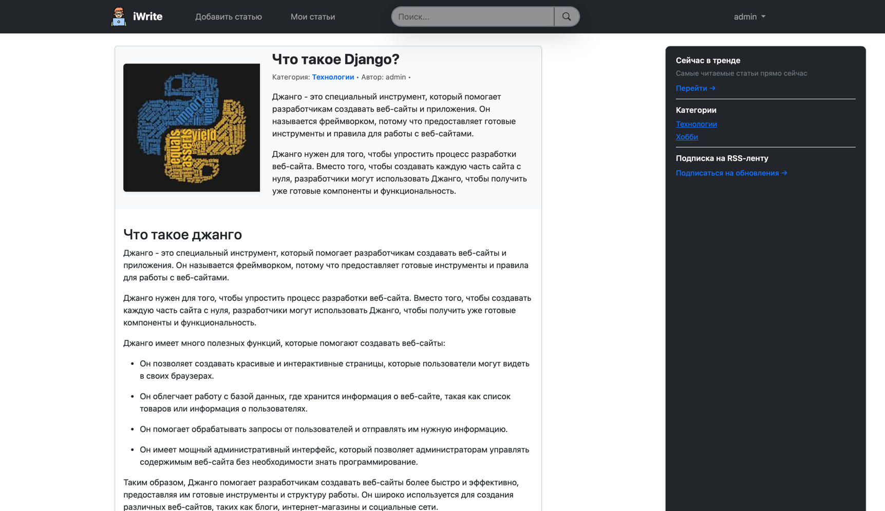
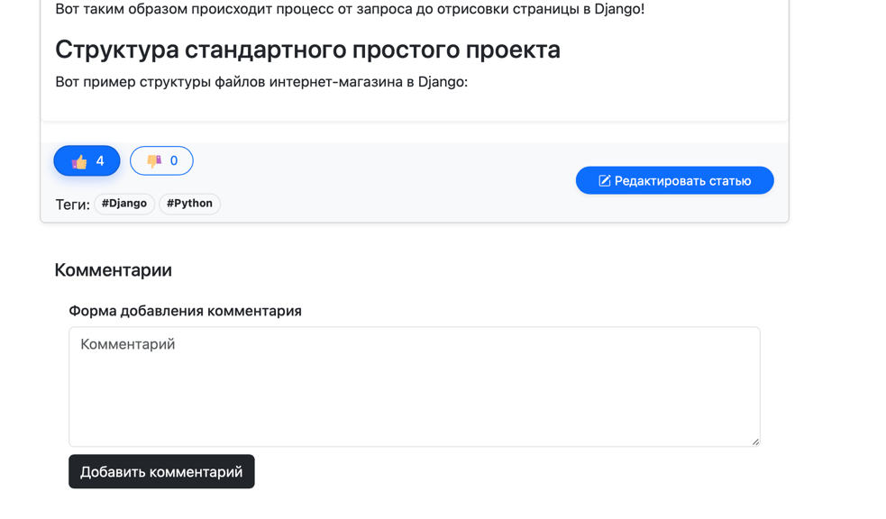
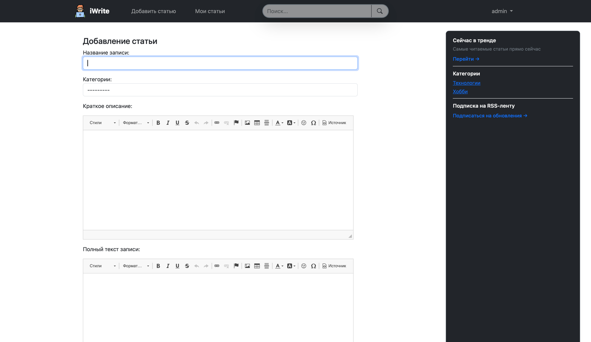

<div align="center">
    
    <h2 style="margin-top: -15px;">iWrite</h2>
</div>


Мой pet-project — полноценная блоговая платформа на Django. 
Платформа позволяет создавать, редактировать и просматривать посты с возможностью поставить лайк и прокомментировать пост.

Кастомная система рекомендаций, построенная на основе пользовательской активности, позволяет получать самые свежие и популярные записи.

## Содержание
- [Технологии](#технологии)
- [База данных](#архитектура-базы-данных)
- [Структура проекта](#структура-проекта)
- [Ключевые фичи](#ключевые-фичи-проекта)
- [Скриншоты](#скрины-приложения)
- [Команда проекта](#команда-проекта)

## Технологии
- [Django](https://www.djangoproject.com)
- [Redis](https://redis.io)
- [PostgreSQL](https://www.typescriptlang.org/)
- [Docker](https://www.docker.com)
- [Python](https://www.python.org)
- [JavaScript](https://developer.mozilla.org/ru/docs/Web/JavaScript)
- [CKEditor](https://ckeditor.com)
- [reCAPTCHA](https://developers.google.com/recaptcha)
- [Taggit](https://django-taggit.readthedocs.io/en/latest/)
- [OAuth](https://oauth.net/2/)


## Архитектура базы данных



## Структура проекта

```
├── README.md
├── .gitignore
├── docker-compose.yml
├── Docker
├── entrypoint.sh           # Скрипт для инициализации кэша и создания БД
├── requirements.txt
├── docs/                   # Документы и файлы для README 
├── media/                  # Аватары и картинки к постам
├── static/                 # Файлы js и css а также иконки для сайта
├── blog_advanced/          # настройки проекта 
├── templates/              
│   ├── accounts/           # Шаблоны аккаунтов и страниц регистрации
│   ├── blog/               # Шаблоны постов и тд
│   ├── errors/             # Шаблоны ошибок
│   ├── includes/           # Дополнительные шаблоны
│   └── ...                 # Шаблоны основной страницы
└── apps/
    ├── accounts            # Аккаунты и логика авторизации
    ├── blog                # Блог
    ├── recommendations     # Сервис рекоммендаций 
    └── sevices             # Доп настройки сервисов       
    
```

--- 
## Ключевые фичи проекта
- Использование Redis для кэширования информации о просмотрах и лайках
- Сервис рекомендации постов на основе статистики по постам
- Использование Celery для регулярного пересчета метрик постов
- Древовидная система категорий постов
- Использования reCaptcha для защиты от спама
- Использование полнотекстового поиска PostgreSQL для поиска блогов
- Создание постов с встроенным WYSIWYG редактором
- Настроенная подписка на обновления сайта используя RSS
- Система лайков/дизлайков для постов

---

## Скрины приложения

#### Регистрация

#### Вход

#### Список постов

#### Поиск 

#### Пост

#### Создание комментария

#### Создание поста


---

## Команда проекта

- [Павлычев Семен Михайлович](https://t.me/Sem0nch1k) — Backend Python Developer